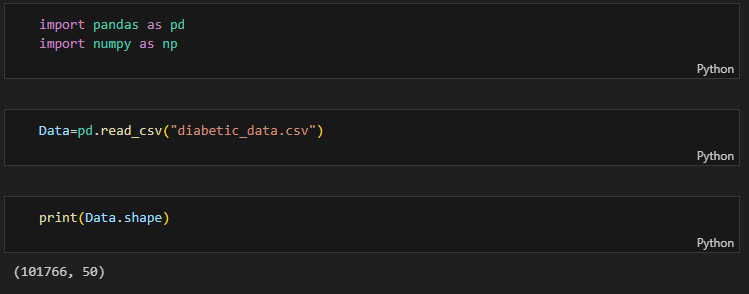
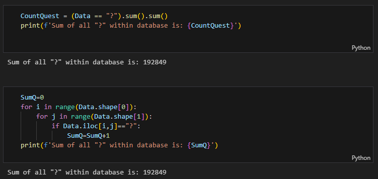
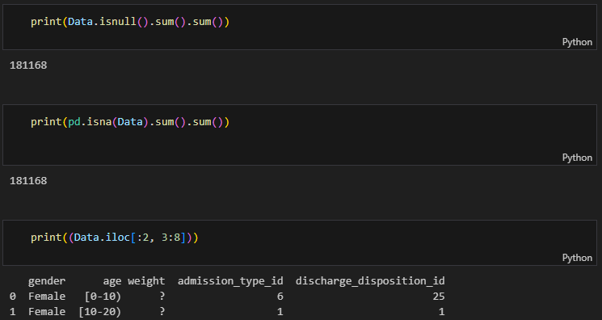

# Diabetes data classifications
In this project, I want to use Random Forest and XGBoost to classify diabetes data.
The dataset is available at this [Link](https://archive.ics.uci.edu/dataset/296/diabetes+130-us+hospitals+for+years+1999-2008), which was uploaded by U of California, Irvine.

## Data Preparation
At the first step, I read the data as follows:

This file has a size of 101766x50, which indicates 101766 data samples with 50 features.

Based on the data description, we can see that only six features including:
```python
['gender','age','diag_1','diag_2','diag_3','readmitted']
```
are the most important ones, where ```'readmitted'``` is our target feature.

This data includes some irrelevant information, which was saved as "?". We have to transform them into 'Nan' data.
From the description below, we can see the number of "?" cells in the CSV file;



Below, we can see the number of 'Nan' cells in data.



where we can see from 
```python
print((Data.iloc[:2, 3:8]))
```

where we can see ```"?"``` in ```weight``` is identified as non ```Nan``` cell, therefore, we have to transform all ```"?"``` cells into ```Nan```.
So, we use the following code to transform all ```?``` into ```Nan```:
```python
Data.replace("?",np.nan,inplace=True)
```
## Labeling
In this section, we have to create a label for each string-based data such as the diagnosis features ```diag_1, diag_2```, and ```diag_3```.
This is because we want to develop a classification model. Although the model iteself can provide internal labels, however, we can perform this labeling, providing a mechanism to simplify further data evaluations.
Hence, for ```gender``` we have ```Female=1``` and ```Male=2```, and ```age``` we have ```"[0-10)"=1,...,"[90-100)"=10, and "other"=11```


