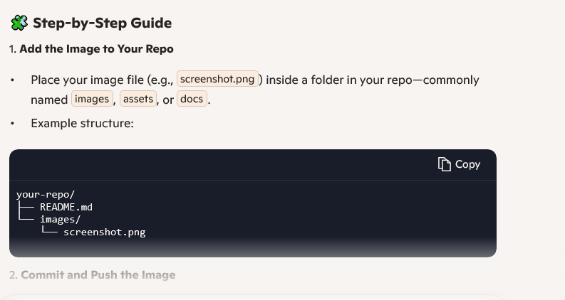

# Diabetes data classifications
In this project, I want to use Random Forest and XGBoost to classify diabetes data.
The dataset is available at this [Link](https://archive.ics.uci.edu/dataset/296/diabetes+130-us+hospitals+for+years+1999-2008), which was uploaded by U of California, Irvine.

